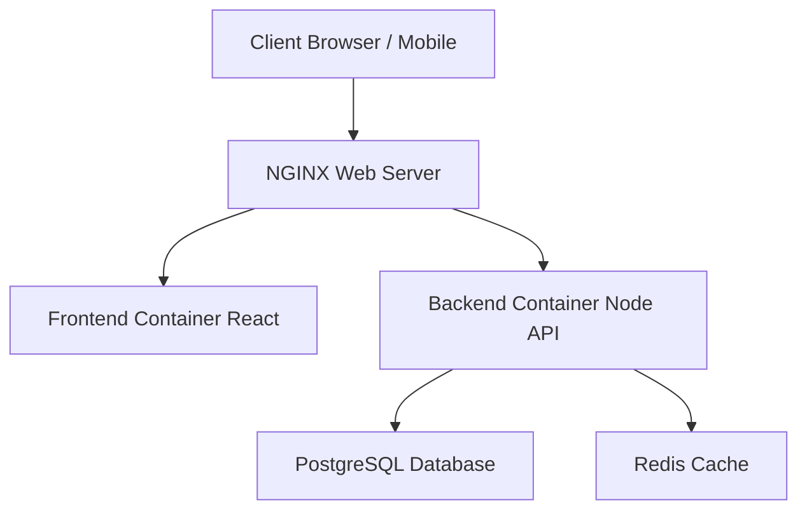

# 🇱🇷 Liberia Market: Infrastructure & Framework Overview

## 1. Executive Summary
**Status:** POC / Production-Ready Candidate
**Objective:** A mobile-first, localized e-commerce platform connecting Liberian buyers and sellers.
**Key Differentiator:** Built specifically for the Liberian context (low-bandwidth optimization, "Bargaining" culture, Mobile Money integration).

---

## 2. Technical Framework

### **Frontend (The User Experience)**
*   **Core Framework:** **React 18** (Modern, fast, component-based UI).
*   **Language:** **TypeScript** (Ensures code reliability and fewer bugs).
*   **Build Tool:** **Vite** (Extremely fast loading and performance).
*   **Key Libraries:**
    *   `Axios`: For secure communication with the backend.
    *   `Socket.io-client`: For real-time messaging and notifications.
    *   `React Router`: For smooth navigation without page reloads.

### **Backend (The Engine)**
*   **Runtime:** **Node.js** (Scalable, event-driven architecture).
*   **Framework:** **Express.js** (Robust API handling).
*   **Database ORM:** **Sequelize** (Secure database interactions, preventing SQL injection).
*   **Security:**
    *   `Helmet`: Sets secure HTTP headers.
    *   `Rate Limiting`: Protects against brute-force attacks.
    *   `JWT`: Secure, stateless user authentication.

---

## 3. Infrastructure Architecture

The platform uses a **Containerized Microservices Architecture** managed by Docker. This ensures that what you show in the demo is exactly what runs in production.

### **Diagram**

### **Components**
1.  **Web Server (Nginx):** Handles incoming traffic, serves the frontend app, and securely routes API requests to the backend.
2.  **Application Server (Node.js):** Processes business logic (registrations, offers, payments).
3.  **Primary Database (PostgreSQL):** Enterprise-grade relational database for storing users, products, and transactions.
4.  **Cache Layer (Redis):** High-speed storage for sessions and real-time features.

---

## 4. Demo Presentation Guide

### **A. Pre-Demo Checklist**
1.  **Database State:** Ensure the database is clean but populated with "Golden Data" (perfect examples).
2.  **Environment:** Ensure `docker-compose up` runs without errors.
3.  **Mobile View:** Since this is "Mobile-First," present the demo using the **Mobile View** in your browser (F12 -> Toggle Device Toolbar) to show off the responsive design.

### **B. Suggested Demo Flow**
1.  **The "Hook":** Start on the **Home Page**. Show the "Market Tip" and "Look-look is free" messaging to prove cultural fit.
2.  **The "Seller Journey":**
    *   Log in as a Seller (**Ma Juah**).
    *   Show the **"My Market Stand"** dashboard (highlight the "Money Made" and "Bargaining Table").
    *   Add a product (e.g., "Bag of Rice") using the simplified form.
3.  **The "Buyer Journey":**
    *   Switch to a Buyer account (**Kofi**).
    *   Find the item.
    *   **Crucial Step:** Click **"Make Offer"** instead of "Buy Now" to demonstrate the bargaining feature.
4.  **The "Close":** Switch back to the Seller to accept the offer, showing the real-time interaction.
